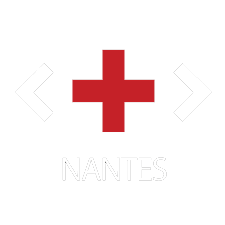
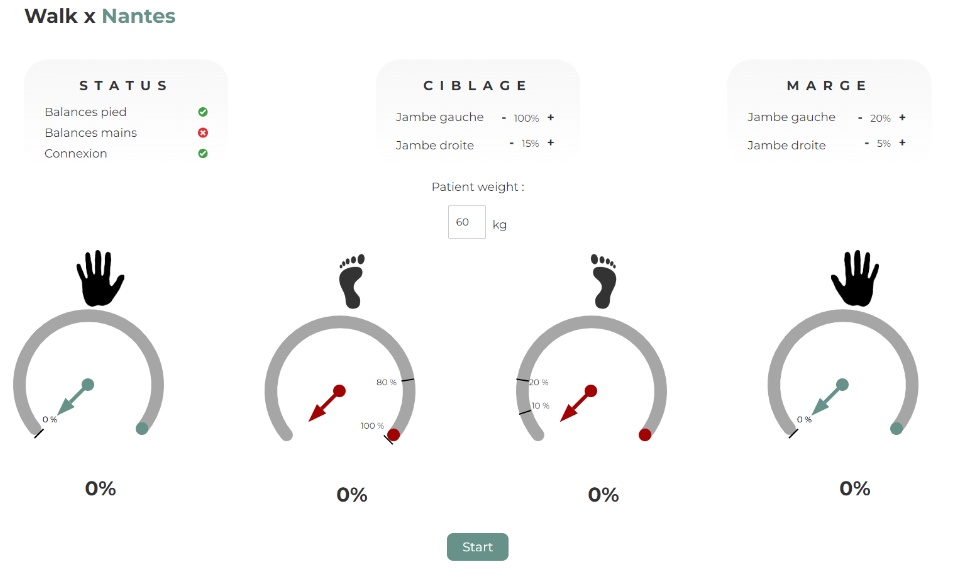

[![Contributors][contributors-shield]][contributors-url]
[![Forks][forks-shield]][forks-url]
[![Issues][issues-shield]][issues-url]
[![MIT License][license-shield]][license-url]
![Prix du public][basic-shield]

<!-- PROJECT LOGO -->
 

  

  <h3 align="center"><strong>Hackiné</strong></h3>

  

    Prototype proposé au marathon d'innovation en santé Hacking Health 2023 à Nantes et <a href="https://www.linkedin.com/feed/update/urn:li:activity:7026592944421826560//">prix du public</a>
     
     
    <a href="https://hacking-health.org/nantes/"><strong>Voir l'événement »</strong></a>
     
    <a href="https://github.com/mgloc/hackine/issues">Signaler un problème</a>
    ·
    <a href="https://github.com/mgloc/hackine/issues">Proposer une amélioration</a>
  

<!-- ABOUT THE PROJECT -->
## À propos du projet

**Problème et Contexte :**

*Titre : À la recherche d’une évidence dans la reprise d’appui en prise en charge kiné*

Au cours de leur rééducation, les patients doivent apprendre à mettre le bon poids sur chacun de leur membres. Cela se fait en marchant entre deux barres parallèles.

Les services techniques du CHU ont conçu un socle muni de deux balances pour évaluer le poids du patients sur chacune de ses jambes. 

L’outil comporte deux limitations majeures : on ne peut connaitre la répartition des poids que lorsque le patient est immobile et non lorsqu’il marche ; on ne peut pas évaluer la répartition des poids sur les bras. En outre, le réglage des barres parallèles (plusieurs fois par jour) est à l’origine de douleurs pour les soignants.

## Notre solution

(a détailler au futur)

Interface intuitive et réactive en temps réel

### Built With

* [![Svelte][Svelte.dev]][Svelte-url]
* [![Python][Python.dev]][Python-url]
* [![Arduino][Arduino.dev]][Arduino-url]

<!-- LICENSE -->
## License

Distributed under the MIT License. See `LICENSE.txt` for more information.

<!-- MARKDOWN LINKS & IMAGES -->
<!-- https://www.markdownguide.org/basic-syntax/#reference-style-links -->
[contributors-shield]: https://img.shields.io/github/contributors/mgloc/hackine.svg?style=for-the-badge
[contributors-url]: https://github.com/mgloc/hackine/graphs/contributors
[forks-shield]: https://img.shields.io/github/forks/mgloc/hackine.svg?style=for-the-badge
[forks-url]: https://github.com/mgloc/hackine/network/members

[issues-shield]: https://img.shields.io/github/issues/mgloc/hackine.svg?style=for-the-badge
[issues-url]: https://github.com/mgloc/hackine/issues
[license-shield]: https://img.shields.io/github/license/mgloc/hackine.svg?style=for-the-badge
[license-url]: https://github.com/mgloc/hackine/blob/master/LICENSE.txt

[basic-shield]: https://img.shields.io/badge/Prix%20du%20public-555555?style=for-the-badge

[Svelte.dev]: https://img.shields.io/badge/Svelte-4A4A55?style=for-the-badge&logo=svelte&logoColor=FF3E00
[Svelte-url]: https://svelte.dev/
[Python.dev]: https://img.shields.io/badge/Python-4A4A55?style=for-the-badge&logo=python
[Python-url]: https://www.python.org/
[Arduino.dev]: https://img.shields.io/badge/Arduino-4A4A55?style=for-the-badge&logo=arduino
[Arduino-url]:https://www.arduino.cc/